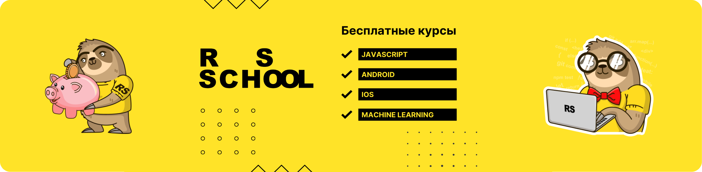

# RSSchool JavaScript Course



<h2 align="center">RSSchool JavaScript Course</h2>

<p align="center">This repository contains basic projects and other course materials developed using JavaScript.</p>

<hr />

<h4 align="center">Installation Process</h4>

##### Clone repo:

```bash
git clone https://github.com/Azizbek98/RSSchool-JavaScript.git
```

##### Install and run:

```bash
cd [task_name]
npm install
npm start
```

Build project in production mode (if this mode exists):

```bash
npm run build
```
